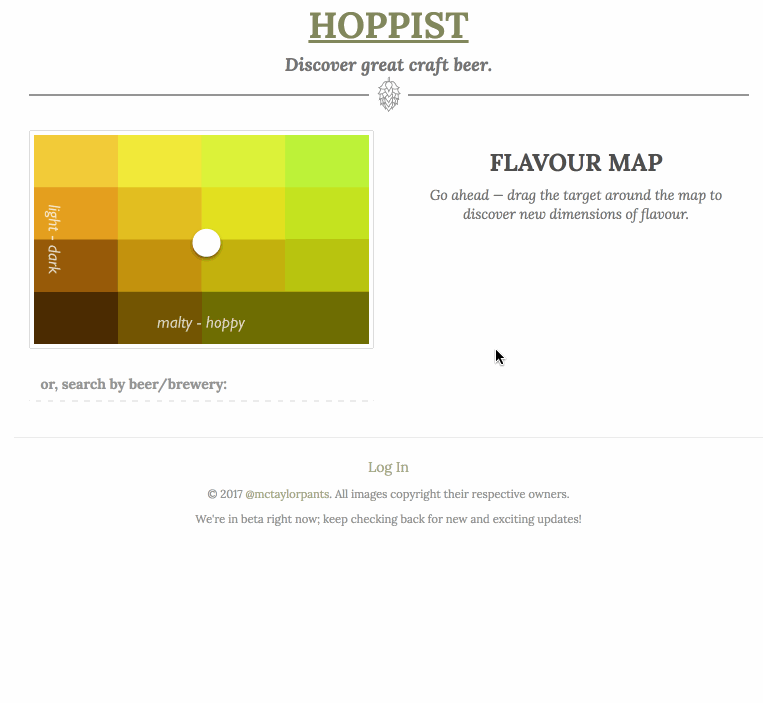
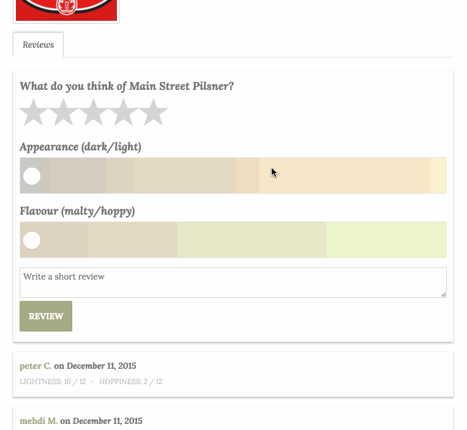

## HOPPIST

*check us out at [hoppist.herokuapp.com](http://hoppist.herokuapp.com)*

Hoppist connects you with local breweries in your area. Discover new flavours, rate your favourite beer, and see what’s currently on tap for samples and fills. Hoppist is the perfect drinking buddy.

### DISCOVER
HOPPIST is a recommendation site for craft beer. We think you should discover beer like you discover movies — by asking yourself what you’re in the mood for. Check out our innovative Flavour Map to discover your next favourite brew. Or, try out our Match Maker if you’re looking for something curated to your favourite tastes.

### DISCERN
HOPPIST is driven by you. Sign up and start rating the beers you love - and the ones you don't. In addition to rating the quality, you can also profile the appearance and flavour - you'll help drive our flavour map and recommendation engine.

### DRINK!
Beer should be social. HOPPIST gives you a beautiful space to showcase your favourite brews, and see what your friends are drinking. Follow your favourite breweries to get their latest social media updates.

### DEMO

----

### About the Project
HOPPIST was created by Alex Taylor as his final project for [CodeCore's](http://www.codecore.ca) Web Development Bootcamp. It runs a Ruby on Rails backend which serves a JSON API to a fully React frontend. 
